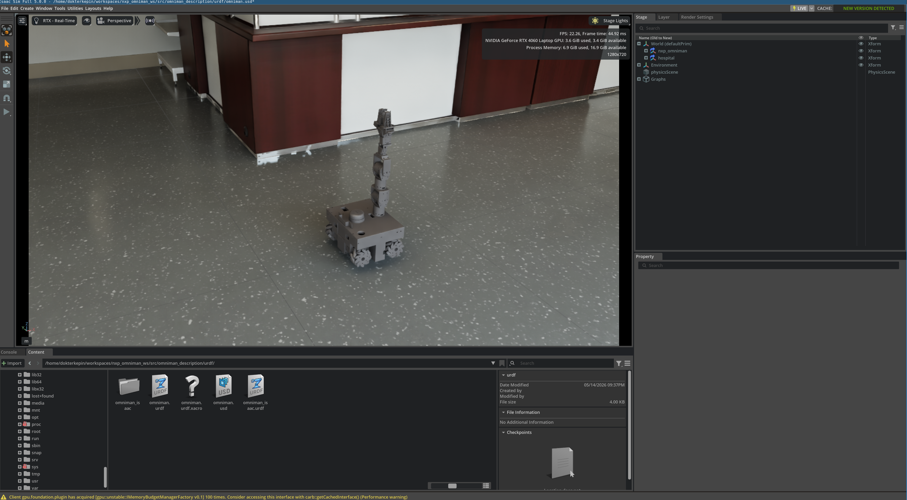

# NXP Omniman

A ROS 2 Humble mobile manipulator featuring a mecanum-wheeled base with a 6-DOF arm and gripper.
The robot uses CyberGear motors (base + arm), Dynamixel servos (wrist + gripper), and an RPLidar
for SLAM and navigation.

## Table of Contents

- [Hardware Overview](#hardware-overview)
- [Prerequisites](#prerequisites)
- [Installation](#installation)
- [CAN Bus Setup](#can-bus-setup)
- [Udev Rules](#udev-rules)
- [Build](#build)
- [Quick Start](#quick-start)
- [ros2_control](#ros2_control)
- [MoveIt](#moveit)
- [Navigation](#navigation)
- [Simulation (Isaac Sim)](#simulation-isaac-sim)
- [Hand Teleop (MediaPipe)](#hand-teleop-mediapipe)
- [Package Overview](#package-overview)

## Hardware Overview

| Component | Hardware | Interface | Count |
|---|---|---|---|
| Mecanum wheels | CyberGear motors | CAN bus (`can_base`) | 4 |
| Arm joints (shoulder, upper shoulder, arm, forearm) | CyberGear motors | CAN bus (`can_arm`) | 4 |
| Wrist + gripper (wrist pitch, palm yaw, finger) | Dynamixel servos | Serial (`/dev/dynamixel`) | 3 |
| Lidar | RPLidar | Serial (`/dev/rplidar`) | 1 |

## Prerequisites

- **OS:** Ubuntu 22.04
- **ROS 2:** Humble Hawksbill (desktop-full)
- **MoveIt 2:** Humble branch
- **Nav2:** Humble branch

Install ROS 2 Humble following the [official guide](https://docs.ros.org/en/humble/Installation/Ubuntu-Install-Debs.html).

## Installation

```bash
# Create workspace
mkdir -p ~/workspaces/nxp_omniman_ws/src
cd ~/workspaces/nxp_omniman_ws/src

# Clone the repository
git clone git@github.com:dokterkepin/nxp_omniman_ws.git .

# Install all ROS dependencies via rosdep
cd ~/workspaces/nxp_omniman_ws
rosdep install --from-paths src --ignore-src -r -y

# Install system tools not covered by rosdep
sudo apt install -y can-utils
```

## CAN Bus Setup

The robot uses two CAN buses: `can_base` for mecanum wheels and `can_arm` for arm joints.

```bash
# Bring up both CAN interfaces (run once after boot)
cd ~/workspaces/nxp_omniman_ws/src/cybergear_hardware
sudo bash bringup_canbus.sh
```

Verify CAN is up:

```bash
ip link show can_base
ip link show can_arm
```

For more details, see [docs/can-bus.md](docs/can-bus.md) and
[docs/motor-zero-position.md](docs/motor-zero-position.md).

## Udev Rules

Udev rules map the RPLidar and Dynamixel to fixed device names (`/dev/rplidar`, `/dev/dynamixel`),
so the port doesn't change when devices are plugged in different USB slots.

See [docs/udev-rules.md](docs/udev-rules.md) for setup instructions.

## Build

```bash
cd ~/workspaces/nxp_omniman_ws
source /opt/ros/humble/setup.bash
colcon build --symlink-install
source install/setup.bash
```

---

## Quick Start

Every session on real hardware follows this boot sequence:

**Step 1 — CAN bus** (after every reboot)
```bash
cd ~/workspaces/nxp_omniman_ws/src/cybergear_hardware
sudo bash canbus_init.sh
```

**Step 2 — ros2_control** (always required)
```bash
ros2 launch omniman_ros2_control nxp_omniman_launch.py
```

**Step 3 — choose a feature**

| Goal | Command |
|---|---|
| Motion planning (MoveIt RViz) | `ros2 launch omniman_moveit_config moveit_rviz.launch.py` |
| Joystick arm control (Servo) | `ros2 launch moveit_servo servo_example.launch.py` |
| Hand gesture arm control | `ros2 launch omniman_hand_teleop omniman_hand_teleop.launch.py` |
| SLAM mapping | `ros2 launch omniman_navigation slam_launch.py` |
| Autonomous navigation | `ros2 launch omniman_navigation nav2_launch.py` |

> For Isaac Sim, skip Step 1 and add `use_sim:=true` to every launch in Step 2 and 3.

---

## ros2_control

This launches all hardware interfaces, the controller manager, and controllers
(mecanum drive, arm trajectory, gripper).

```bash
ros2 launch omniman_ros2_control nxp_omniman_launch.py
```

To also enable joystick teleoperation:

```bash
ros2 launch omniman_ros2_control nxp_omniman_launch.py use_joy:=true
```

Or instead enable keyboard teleoperation:

```bash
ros2 launch omniman_ros2_control nxp_omniman_launch.py use_keyboard:=true
```

Verify controllers are running:

```bash
ros2 control list_controllers
```

You should see:
- `joint_state_broadcaster` — active
- `mecanum_drive_controller` — active
- `arm_controller` — active
- `gripper_controller` — active

---

## MoveIt

Motion planning via RViz interactive markers, real-time joystick control via MoveIt Servo,
and hand gesture teleop via MediaPipe + Servo pose tracking.
ros2_control must be running first.

```bash
ros2 launch omniman_moveit_config moveit_rviz.launch.py   # motion planning (real hardware)
ros2 launch moveit_servo servo_example.launch.py           # joystick servo teleop
```

See [docs/moveit.md](docs/moveit.md) for all three control modes, the `use_trajectory` flag, and joystick mapping.

---

## Navigation

SLAM mapping with `slam_toolbox` + `rf2o` laser odometry, and autonomous navigation with Nav2 + AMCL.
ros2_control must be running first.

```bash
ros2 launch omniman_navigation slam_launch.py      # mapping
ros2 launch omniman_navigation nav2_launch.py      # autonomous navigation
```

See [docs/navigation.md](docs/navigation.md) for the full pipeline, map saving, and multi-machine setup.

---

## Simulation (Isaac Sim)

The robot can run in NVIDIA Isaac Sim using the `TopicBasedSystem` ros2_control plugin.
**Always pass `use_sim:=true`** to every launch file when running in simulation.
For more detail see [docs/simulation.md](docs/simulation.md).

```bash
ros2 launch omniman_ros2_control nxp_omniman_launch.py use_sim:=true use_joy:=true
ros2 launch omniman_moveit_config moveit_rviz.launch.py
ros2 launch omniman_navigation slam_launch.py use_sim:=true
```

The USD scene files are in `omniman_description/urdf/omniman_isaac/` (open `omniman_isaac.usd` in Isaac Sim).



---

## Hand Teleop (MediaPipe)

Control the arm with hand gestures from a webcam using Google MediaPipe landmark detection
and MoveIt Servo. Requires ros2_control in Servo mode (`use_trajectory:=false`).

```bash
ros2 launch omniman_hand_teleop omniman_hand_teleop.launch.py
```

See [docs/hand-teleop.md](docs/hand-teleop.md) for launch sequence, gesture mapping, and parameters.

---

## Package Overview

| Package | Description |
|---|---|
| `omniman_description` | URDF/xacro model, meshes, and Isaac Sim USD files |
| `omniman_ros2_control` | Main launch file, controller config, URDF with ros2_control hardware tags |
| `omniman_moveit_config` | MoveIt configuration (SRDF, kinematics, planning pipeline) |
| `omniman_navigation` | SLAM, Nav2, EKF configs, and saved maps |
| `omniman_hand_teleop` | MediaPipe hand gesture teleop for the arm via MoveIt Servo |
| `omniman_commander` | Mission scripts and MoveIt commander nodes (pick-place, FIRA, traffic) |
| `cybergear_hardware` | CyberGear/Robstride motor driver, CAN bus setup, ros2_control plugin |
| `dynamixel_hardware` | Dynamixel servo driver, SDK, and ros2_control plugin |
| `rf2o_laser_odometry` | Laser scan-based odometry (rf2o algorithm) |
| `rplidar_ros` | RPLidar driver |
