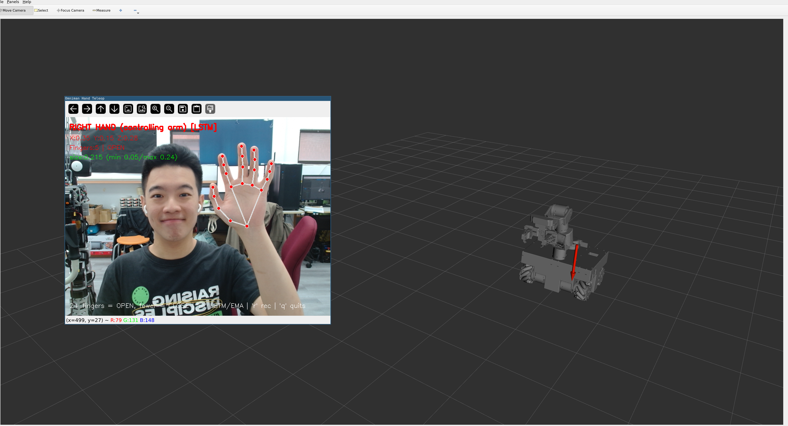

# MediaPipe Hand Teleop

Control the robot arm using hand gestures captured from a webcam, powered by Google MediaPipe.

## Overview

The `omniman_hand_teleop` package tracks your right hand with a webcam, maps the hand position to a target end-effector pose, and drives the arm in real time using MoveIt Servo pose tracking.

**Pipeline:**
```
Webcam → MediaPipe landmarks → EMA smoothing → /hand_target_pose → MoveIt Servo → JointTrajectoryController → Robot
```

## Prerequisites

- USB webcam (default `/dev/video0`, see below to change)
- ROS 2 Jazzy + MoveIt 2
- A Python 3.12 environment for the MediaPipe node (see below)

### Python environment (one-time setup)

The node runs in its own environment. It must be Python 3.12 — that is the version ROS 2 Jazzy's `rclpy` is built for.

```bash
conda create -y -n hand_teleop python=3.12
conda activate hand_teleop
pip install -r ~/workspaces/nxp_omniman_ws/src/omniman_hand_teleop/requirements.txt
```

Activate it before every launch, then source ROS:

```bash
conda activate hand_teleop
source /opt/ros/jazzy/setup.bash
source ~/workspaces/nxp_omniman_ws/install/setup.bash
```

### Camera udev rule (one-time setup)

Get your camera's vendor and product ID:
```bash
udevadm info /dev/video0 | grep -E "ID_VENDOR_ID|ID_MODEL_ID"
```

Create the rule:
```bash
sudo nano /etc/udev/rules.d/99-camera.rules
```
```
SUBSYSTEM=="video4linux", ATTRS{idVendor}=="046d", ATTRS{idProduct}=="08e5", SYMLINK+="video_c920", MODE="0666"
```
```bash
sudo udevadm control --reload-rules && sudo udevadm trigger
```

To use a different camera, edit [`config/teleop.yaml`](../omniman_hand_teleop/config/teleop.yaml):
```yaml
hand_pose_publisher_node:
  ros__parameters:
    camera_device: "/dev/video_c920"   # or integer index e.g. 0
```

## Launch

### Demo mode (no robot needed)
```bash
ros2 launch omniman_hand_teleop omniman_hand_teleop_demo.launch.py
```

### Real hardware
```bash
# Terminal 1 — hardware bringup (JTC mode required for named-pose reset)
ros2 launch omniman_ros2_control nxp_omniman_launch.py use_trajectory:=true

# Terminal 2 — hand teleop
ros2 launch omniman_hand_teleop omniman_hand_teleop.launch.py
```


## Controls

| Hand | Gesture | Action |
|------|---------|--------|
| Right | Open palm (2+ fingers) | Move arm — hand position maps to EE target |
| Right | Closed fist (< 2 fingers) | Close gripper |
| Left | Open palm (4+ fingers) | Reset arm to `ready` pose (singularity escape) |

> The left-hand reset requires `use_trajectory:=true` on the hardware bringup. It uses MoveIt `move_group` to execute a named pose trajectory.

## Workspace Calibration

The hand-to-robot mapping is controlled by parameters in the node. Watch the on-screen HUD:

- **`size=`** — apparent palm size used for depth (X axis). Hold hand at nearest/farthest reach and tune `hand_size_min` / `hand_size_max` via `ros2 param set`
- **`X/Y/Z`** — current EE target in metres

Workspace bounds (`robot_x_min/max`, `robot_y_min/max`, `robot_z_min/max`) can also be tuned live without rebuilding.

## Troubleshooting

### Arm doesn't follow hand
- Check `use_trajectory` matches between bringup and teleop launch
- With `use_trajectory:=false` (JGPC), the named-pose reset won't move the physical arm

### Arm stuck at joint limit (`wrist_pitch_joint`)
The servo halts when a joint approaches its limit and keeps restarting in a loop. Fix:
1. Show your left hand (open palm) to trigger a reset to `ready` pose
2. After reset, hold your right hand in the centre of your chest before resuming tracking
3. If still stuck, stop the launch and manually home the arm
