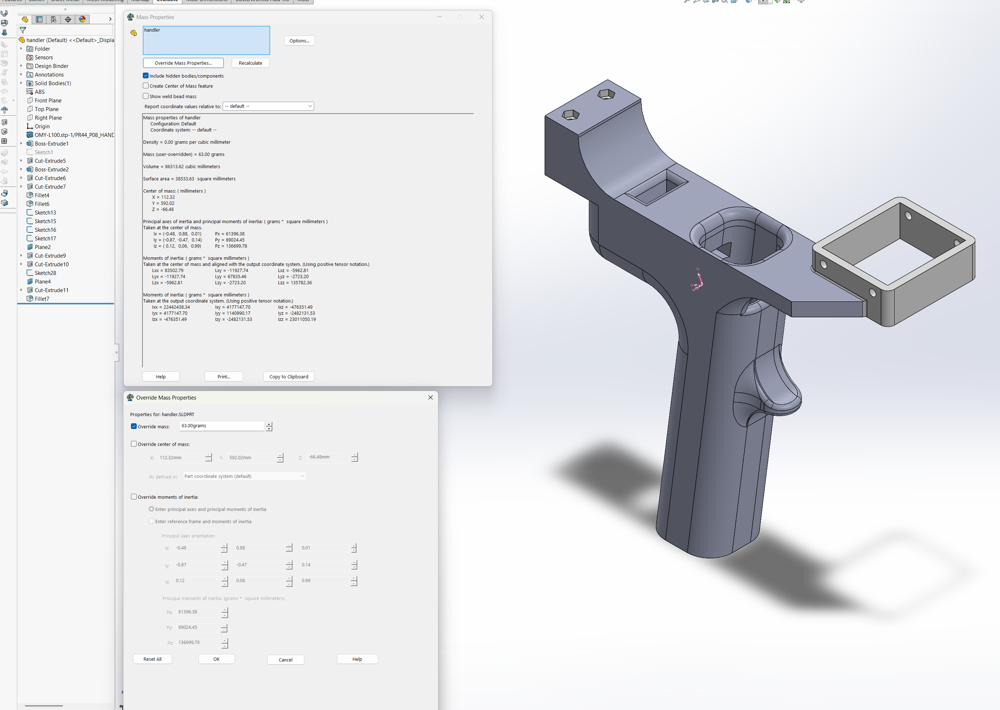
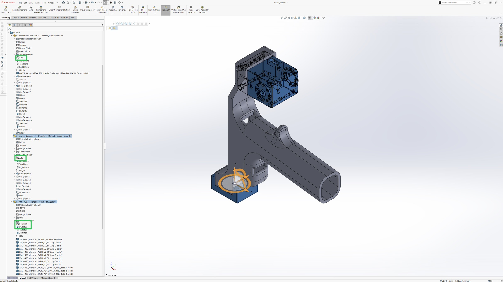

# Leader-Follower Teleoperation & Gravity Compensation

How the XM430 leader arm is hand-guided and how its motion drives the omniman follower.

This is the foundation for [vla-training.md](vla-training.md) — demonstrations cannot be
recorded until teleoperation works.

---

## Quick start

Two launches, deliberately separate.

**Leader only (gravity compensation + RViz):**
```bash
ros2 launch leader_ros2_control leader_gravity_launch.py
```
The leader arm now floats — push it by hand and it stays where you leave it. Nothing else moves.

**Connect leader → follower (the "go" button):**
```bash
ros2 launch leader_ros2_control teleop_bridges_launch.py
```

Bring the follower up first, match the two arms' poses by hand, *then* connect. The split exists
so nothing can move unexpectedly at startup.

---

## The three controllers

All three run simultaneously on the same arm. They coexist because they claim
**different ros2_control interfaces**:

| Controller | Joints | Command interface | Role |
|---|---|---|---|
| `gravity_compensation_controller` | 6 arm joints | **effort** | cancels the arm's own weight |
| `spring_actuator_controller` | `gripper_prismatic_joint` | **effort** | spring feel on the trigger |
| `joint_trajectory_command_broadcaster` | all 7 | **none** (read-only) | publishes positions for the follower |

The two effort controllers write to *disjoint* joint sets, so they never fight. The broadcaster
claims no command interfaces at all, so it layers freely on top of both.

**Friction compensation** exists because the model gives the *ideal* torque while real gearboxes resist motion.

**static-friction** alternates ±torque every cycle to break stiction —
that faint buzz at rest is intentional and is what stops the arm feeling sticky.

---

## Gravity compensation parameters

From `leader_ros2_control/config/controllers_gravity.yaml`:

```yaml
gravity_compensation_controller:
  ros__parameters:
    joints: [shoulder_yaw_joint, upper_shoulder_pitch_joint, arm_yaw_joint,
             forearm_pitch_joint, wrist_pitch_joint, palm_yaw_joint]
    command_interfaces: [effort]
    state_interfaces:   [position, velocity]
    kinetic_friction_scalars:  [1.0, 1.0, 0.8, 0.8, 0.8, 0.8]
    torque_scaling_factors:    [80.0, 130.0, 80.0, 125.0, 90.0, 80.0]
    enable_spring_effect: false
```

| Parameter | What it does |
|---|---|
| `torque_scaling_factors` | **unit conversion**, N·m → Goal Current raw units. The main tuning knob. |
| `kinetic_friction_scalars` | how hard to push against gearbox friction while moving |
| `kinetic_friction_torque_scalars` | scales friction compensation with load |
| `static_friction_scalars` | dithering amplitude at rest (breaks stiction) |
| `friction_compensation_velocity_thresholds` | velocity below which kinetic compensation applies |
| `unloaded_effort_offsets` / `_thresholds` | small extra push when the joint is nearly unloaded |
| `input_velocity_scaling_factors` | damps noisy velocity readings before they enter RNE |
| `enable_spring_effect` | adds a hardcoded bias on joint index 2 — normally `false` |

### Why the scaling factors are ~100 and not ~1

KDL outputs **N·m**, but the XM430-W350 takes Goal Current in raw units of 2.69 mA. With a torque
constant of ~1.78 N·m/A that is roughly **209 raw units per N·m**.

> ROBOTIS' own Y-series configs use values near `1.0` because those actuators accept N·m
> directly. Do not copy their numbers — the units are different.

*Symptom guide:**
| Behaviour | Likely cause |
|---|---|
| Arm sags everywhere | `torque_scaling_factors` too low |
| Arm drifts upward on its own | factors too high |
| Sticky/notchy while moving | raise `kinetic_friction_scalars` |
| Hard to start moving from rest | raise `static_friction_scalars` (dithering) |
| **Springs back to one specific angle** | **wrong CoM in the URDF** — see below |

### Why URDF mass and CoM matter so much

Every `m` and `L` in that equation comes from the URDF. The distinction matters:

- A wrong **mass** scales the torque curve uniformly → the arm feels evenly too heavy or too light.
- A wrong **CoM** changes `L`, the lever arm, so it distorts the *shape* of the `cos(θ)` curve →
  over-compensated at some angles, under-compensated at others.

Where a distorted model curve crosses the true curve, net torque is zero — a **false equilibrium**
the arm springs back to no matter where you release it. Tuning `torque_scaling_factors` cannot fix
this, because scaling a wrongly-shaped curve leaves it wrongly shaped.

> The fix is to remeasure geometry, not to retune gains: set each part's mass in CAD, let the
> assembly compute the combined centre of mass, and copy those values into the URDF.

---

## Getting good mass / CoM / inertia from SolidWorks

A URDF link is usually several physical parts bolted together — brackets, servos, fasteners. The
reliable way to get its inertial properties is **per part first, then assembly**. Never guess the
numbers for a whole link at once.

### Step 1 — Fix each part individually

For every part, get the mass right and let SolidWorks derive the rest.

1. **Assign a material as close to the real one as possible.** 3D-printed brackets → `ABS`.
   For bought parts like servos, pick whatever material brings the computed mass nearest the
   real one. Look up the datasheet, or just weigh it.
2. **Weigh the physical part** on a scale.
3. `Evaluate → Mass Properties → Override Mass Properties`, then tick **`Override mass`** only
   and type the weighed value.



> **Only tick `Override mass`.** Leave **`Override center of mass`** and
> **`Override moments of inertia`** unchecked — that is the whole point. SolidWorks then
> recomputes CoM and the inertia tensor from the real geometry at the corrected mass. Typing a
> CoM by hand is exactly the error that causes false-equilibrium spring-back.

In the screenshot: `handler` is ABS, mass overridden to **63.00 g**, and SolidWorks has computed
`Center of mass: X=112.32, Y=592.02, Z=-66.48 mm` plus the full moment-of-inertia tensor. Those
computed values are what you want — not anything you typed.

### Step 2 — Assemble, then read the combined result

Mate the corrected parts into the assembly that represents one URDF link. Each component keeps its
own material and overridden mass:



Here the palm link is `handler` (ABS) + `gripper_brackets` (ABS) + `XMH-430` servo, each with its
own material. Run **Mass Properties on the assembly** and SolidWorks returns the combined mass, the
combined centre of mass, and the combined inertia tensor.

The combined CoM is *not* something you could have guessed — it is the mass-weighted average of the
parts, and it shifts toward the heavy components (usually the servos).

### Step 3 — Sanity check

```
assembly mass  ==  sum of the individual part masses
```

If they disagree, a part's override did not apply, a component is suppressed, or something is
counted twice. Fix that before trusting the CoM.

> **Worked example of why per-part matters:** a link with servos at *both* ends can gain a lot of
> mass while its CoM barely moves, because the two ends cancel. Only the part-by-part method
> reproduces that. Assigning a single lumped mass to the link would put the CoM in the wrong place
> and distort the whole `cos(θ)` torque curve.

---

## Spring actuator controller (gripper trigger)

Simulates a spring on the leader's trigger so it pushes back toward a neutral position:

```cpp
spring_torque  = -stiffness * (q_trigger - neutral_position);
spring_torque -=  damping   *  q_dot_trigger;
```

```yaml
spring_actuator_controller:
  ros__parameters:
    joints: [gripper_prismatic_joint]
    trigger_spring_stiffness: [0.2]     # restoring force
    trigger_neutral_position: [0.0]     # where it pulls back to
    trigger_damping:          [0.004]   # resists motion, prevents oscillation
    torque_scaling_factors:   [200.0]
```

This is **operator feel only** — it does not affect the follower. Set all three to `0.0` to remove
the spring-back entirely; teleoperation still works.

> Some resistance remains even at `0.0` — that is the servo's own gearbox friction, not the
> controller.

---

## The teleop link

`joint_trajectory_command_broadcaster` reads the leader's positions and publishes them as a
`JointTrajectory`, then a `topic_tools relay` forwards that to the follower:

```
leader hardware
   ↓  dynamixel_hardware_interface
ros2_control state interfaces
   ↓  joint_trajectory_command_broadcaster   (reverse → scale → offset)
/leader/joint_trajectory
   ↓  topic_tools relay                       ← teleop_bridges_launch.py
/arm_controller/joint_trajectory
   ↓  JointTrajectoryController
follower moves
```

Two details make this work:

- **`time_from_start = 0`** — a single waypoint with zero duration means "go there *now*". No
  interpolation or planning, which is what makes it feel direct.
- **Joint matching is by name**, not index. The follower rejects names it does not know — this is
  why the follower's gripper joint was renamed to match the leader's.

The relay arguments are the *entire* "which robot" decision:
```python
arguments=['/leader/joint_trajectory', '/arm_controller/joint_trajectory']
```

### Gripper unit conversion

The leader trigger is **revolute (radians)**; the follower gripper is **prismatic (metres)**. The
broadcaster converts with per-joint `scales` and `offsets`:

```
published = scale * position + offset
```

```yaml
joint_trajectory_command_broadcaster:
  ros__parameters:
    joints:  [... 6 arm joints ..., gripper_prismatic_joint]
    interfaces: [position]
    scales:  [1.0, 1.0, 1.0, 1.0, 1.0, 1.0, 0.0725]
    offsets: [0.0, 0.0, 0.0, 0.0, 0.0, 0.0, 0.019]
```

Derived from mapping leader `[-0.4, 0.0] rad` → follower `[-0.010, 0.019] m`:
```
scale  = (0.019 - (-0.010)) / (0.0 - (-0.4)) = 0.0725
offset = -0.010 - 0.0725 * (-0.4)            = 0.019
```

> These are read at controller **configure** time — relaunch to change them. Unlike the old
> bridge node there is no clamping; the follower's own joint limits do that.

Publishing 7 joints means this drives the **`omniman_vla`** follower only. A 6-joint
`arm_controller` rejects the extra gripper joint.

### Safety interlock

A `true` on `/collision_flag` stops the broadcaster publishing entirely — the follower holds its
last position.
