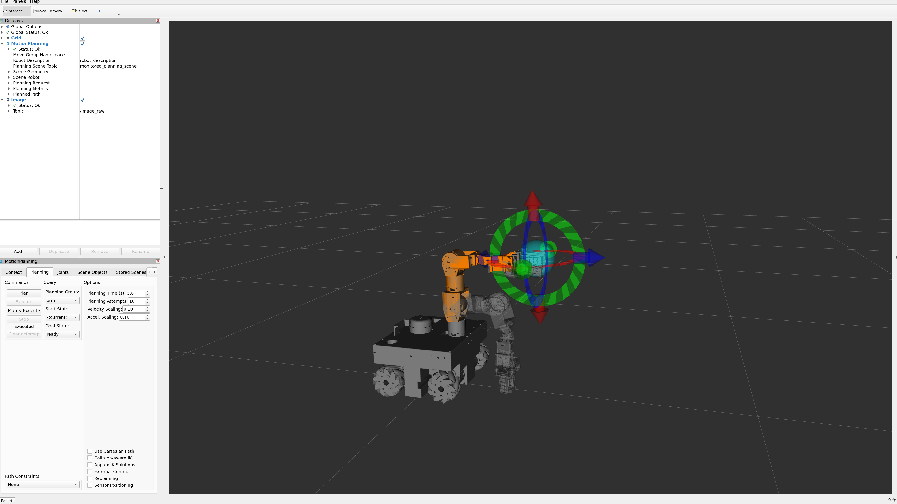

# MoveIt

MoveIt provides motion planning and real-time servo control for the 6-DOF arm and gripper.
ros2_control must be running first for all modes.

There are three ways to control the arm:

| Mode | Interface | Launch |
|---|---|---|
| Motion planning | Interactive markers in RViz | `demo.launch.py` / `moveit_rviz.launch.py` |
| Servo joystick | Xbox controller → real-time joint commands | `servo_example.launch.py` |
| Hand teleop | MediaPipe webcam → real-time pose tracking | See [hand-teleop.md](hand-teleop.md) |

---

## Motion Planning (RViz Interactive Markers)

Use MoveIt's planning pipeline to plan and execute arm trajectories.

### Demo (fake hardware, no robot needed)
```bash
ros2 launch omniman_moveit_config demo.launch.py
```

### Real hardware
```bash
# Terminal 1 — bring up hardware first
ros2 launch omniman_ros2_control nxp_omniman_launch.py use_trajectory:=true

# Terminal 2 — MoveIt + RViz
ros2 launch omniman_moveit_config moveit_rviz.launch.py
```

In RViz:
- Drag the interactive marker (orange sphere at the end-effector) to set a goal pose
- Click **Plan & Execute** to move the arm
- Use the gripper slider to open/close



---

## Servo Joystick Teleop

MoveIt Servo takes a continuous stream of joystick commands and converts them directly
to joint commands — no trajectory planning, no waiting. The arm follows the stick in real time.

**Pipeline:**
```
Xbox controller → joy_linux_node → JoyToServoPub → servo_node → arm_controller
                                                              └→ joy_to_gripper.py → gripper_controller
```

### `use_trajectory` flag — use JGPC, not JTC

Controls which downstream controller Servo publishes to:

| `use_trajectory` | Command type | Controller | For Servo? |
|---|---|---|---|
| `false` | `Float64MultiArray` | `arm_group_position_controller` (JGPC) | **Yes — recommended** |
| `true` (default) | `JointTrajectory` | `arm_controller` (JTC) | No — causes drift |

**Always use `use_trajectory:=false` (JGPC) for Servo.** Using JTC (`true`) produces broken
behaviour: angular commands that should only rotate the wrist also shift the end-effector
position, and the arm feels sluggish and imprecise.

#### Why JTC breaks Servo

MoveIt Servo works by publishing single-point setpoints at high frequency (~100 Hz). JTC was
designed for multi-point trajectory execution, so when it receives a rapid stream of
single-point commands it tries to *smoothly interpolate* between each one using a trapezoidal
velocity profile — doing acceleration and deceleration for every tiny step. This interpolation
causes cumulative joint drift and the unintended coupling between angular and position axes.

JGPC (`JointGroupPositionController`) is a simple forwarding controller with no interpolation
or control law. It passes each setpoint straight to the hardware. That is exactly what Servo
needs.

> [moveit2 issue #2136](https://github.com/moveit/moveit2/issues/2136):

This is a known and widely reported issue. The fix confirmed in the issue thread is switching
to JGPC.

### Launch

```bash
# Terminal 1 — bring up hardware, must explicitly set use_trajectory:=false for JGPC mode
ros2 launch omniman_ros2_control nxp_omniman_launch.py use_trajectory:=false

# Terminal 2 — Servo + joystick
ros2 launch moveit_servo servo_example.launch.py
```

Connect the Xbox controller via USB or Bluetooth before launching.
See [joystick.md](joystick.md) for Bluetooth vs USB axis index differences.

### Joystick mapping

The `JoyToServoPub` node maps joystick axes to Cartesian or joint velocity commands.
The `joy_to_gripper.py` script handles gripper open/close from a button.

> Check `moveit_servo/config/panda_simulated_config.yaml` for the full axis-to-command mapping.

---

## Servo Hand Teleop (MediaPipe)

An alternative to the joystick: the `omniman_hand_teleop` package uses MoveIt Servo's
`PoseTracking` interface — instead of joystick axes, the input is a `PoseStamped` published
from a webcam-based MediaPipe hand tracker.

See [hand-teleop.md](hand-teleop.md) for the full setup.
