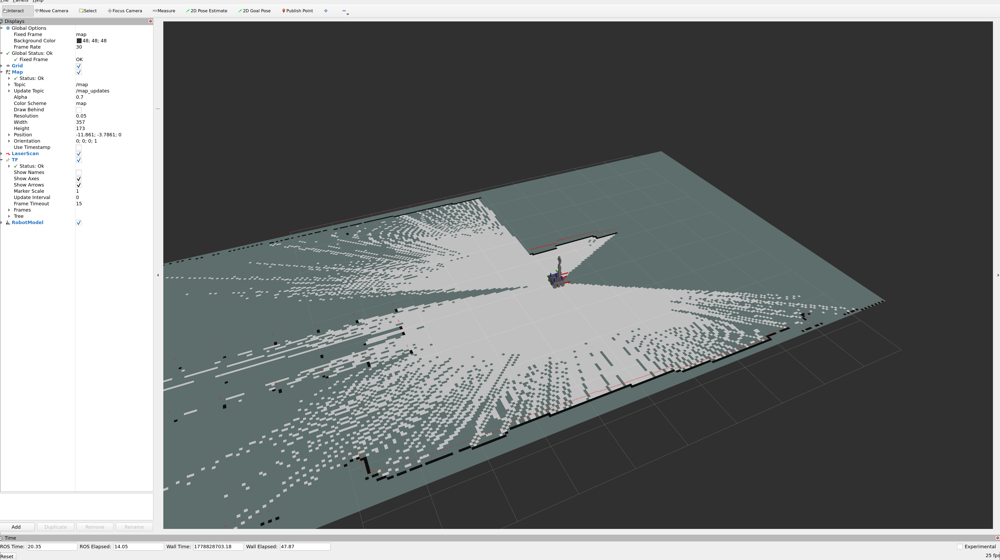
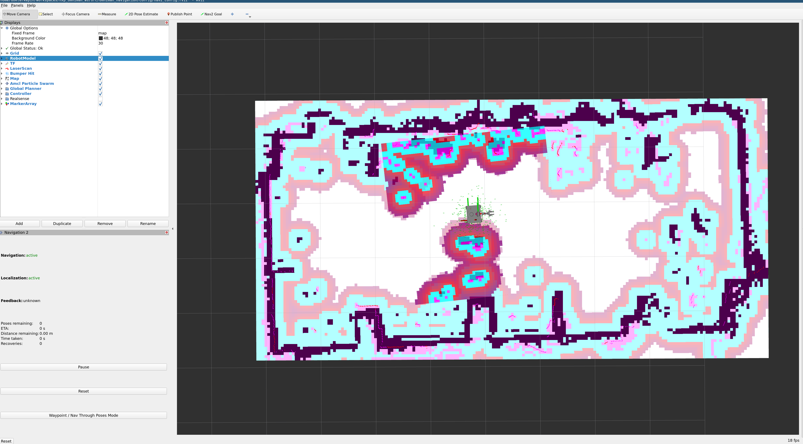

# Navigation

## SLAM (Mapping)

Build a map of the environment using `slam_toolbox` with laser odometry from `rf2o`.
ros2_control must be running first.

```bash
ros2 launch omniman_navigation slam_launch.py
```

This starts:
- **RPLidar** — publishes `/scan`
- **rf2o_laser_odometry** — laser-based odometry → `/odom_rf2o`
- **EKF (robot_localization)** — fuses mecanum wheel odom + rf2o → `/odometry/filtered`
- **slam_toolbox** — builds the map
- **RViz** — visualization

Drive the robot around using joystick or `cmd_vel` to build the map, then save it:

```bash
ros2 run nav2_map_server map_saver_cli -f ~/workspaces/nxp_omniman_ws/src/omniman_navigation/maps/my_map
```



---

## Nav2 (Autonomous Navigation)

Autonomous navigation using a saved map.
ros2_control must be running first.

```bash
ros2 launch omniman_navigation nav2_launch.py
```

This starts the full Nav2 stack:
- **map_server** + **AMCL** — localization on the saved map
- **Nav2 planner/controller** — path planning + DWB local planner (configured for mecanum)
- **rf2o + EKF** — odometry fusion

In RViz:
1. Set the initial pose with **2D Pose Estimate**
2. Send goals with **2D Goal Pose**

> **Note:** Nav2's DWB controller sends `geometry_msgs/TwistStamped`, but teleop_twist_joy sends
> plain `Twist`. A relay node (`twist_to_twist_stamped.py`) bridges this gap when user would like to teleoperate with joystick (use_joy:=true).



---

## Multi-Machine Setup

You can split the workload across two PCs over the same `ROS_DOMAIN_ID`.
The robot PC runs all hardware and navigation; the remote PC handles visualization and input.

**Robot PC:**
```bash
ros2 launch omniman_navigation slam_launch.py
```

**Remote PC (RViz):**
```bash
ros2 launch omniman_navigation rviz_launch.py
```

See [remote-access.md](remote-access.md) for SSH and DDS domain setup.
