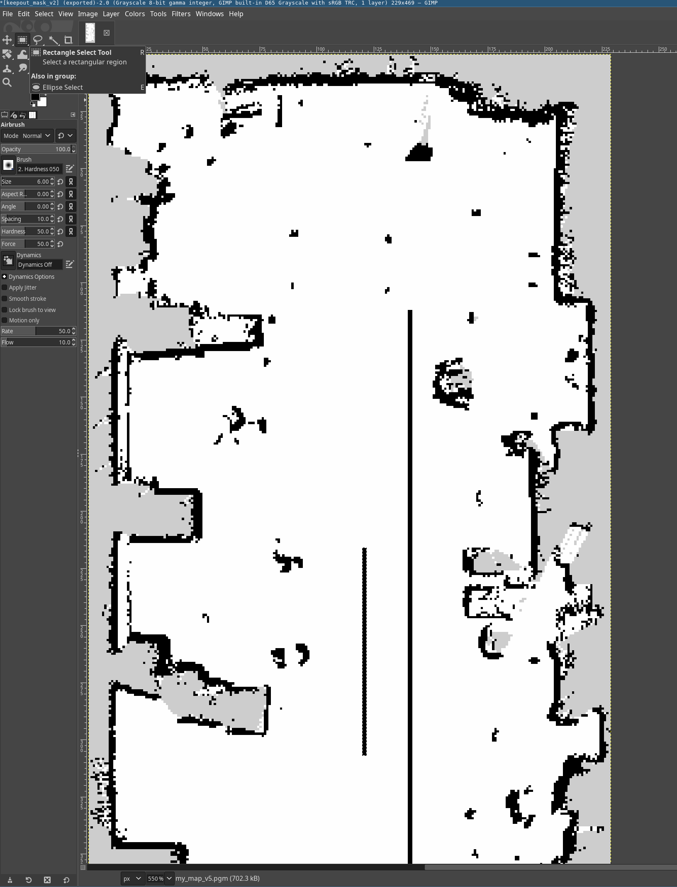
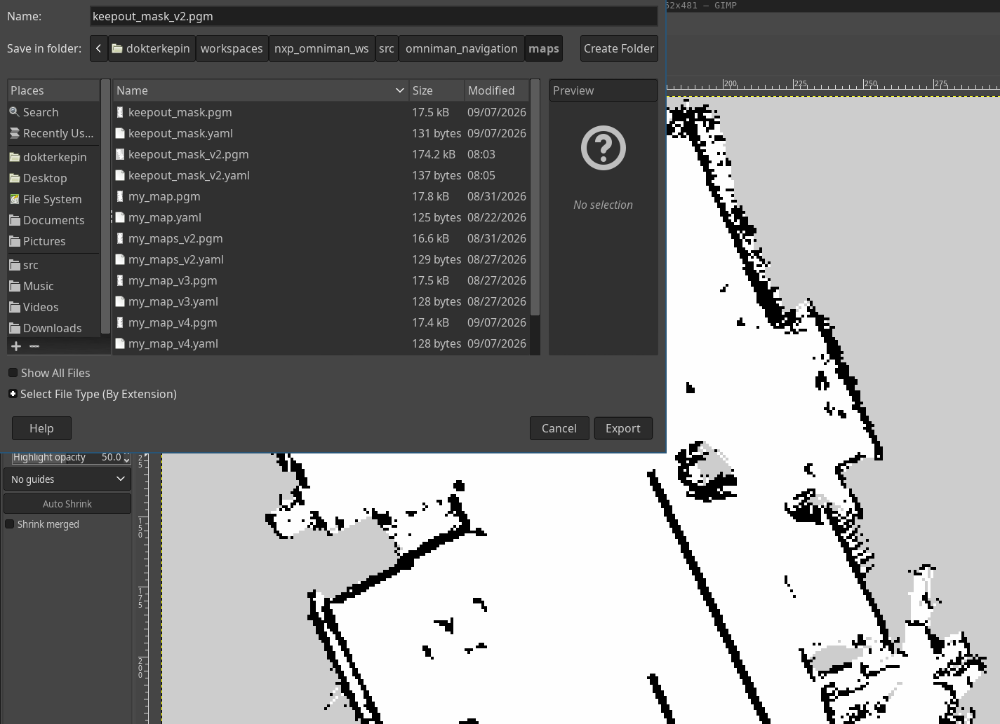

# Navigation

## SLAM (Mapping)

Build a map of the environment using `slam_toolbox`, with wheel odometry from
`mecanum_drive_controller`. ros2_control must be running first (it also starts
the RPLidar and publishes `/scan`).

```bash
ros2 launch omniman_navigation slam_launch.py
```

This starts:
- **slam_toolbox** — builds the map
- **RViz** — visualization

> **Start with the robot at its zero.** The map's origin (0,0) and yaw 0 are
> not picked by `slam_launch.py` — SLAM copies wheel odometry, and odometry
> zeroes itself when the robot bringup (`mecanum_drive_controller`) starts. If
> the robot is moved or rotated after the bringup but before SLAM, the map
> comes out rotated and its origin is not where the robot started mapping.
>
> 1. Put the robot on its start marker: robot **centre** (`base_footprint`)
>    on the marker, facing the direction you want as "straight".
> 2. Start the robot bringup.
> 3. Launch `slam_launch.py` without touching the robot.

Odometry comes from `mecanum_drive_controller`, which publishes
`odom -> base_footprint` itself (`enable_odom_tf: true` in `controllers.yaml`).
`rf2o_laser_odometry` and the `robot_localization` EKF were removed — the
mecanum controller is now the sole odometry source.

Drive the robot around using joystick or `cmd_vel` to build the map, then save it:

```bash
ros2 run nav2_map_server map_saver_cli -f ~/workspaces/nxp_omniman_ws/src/omniman_navigation/maps/my_map
```


---

## Nav2 (Autonomous Navigation)

Autonomous navigation using a saved map.
ros2_control must be running first.

```bash
ros2 launch omniman_navigation nav2_launch.py
```

This starts the full Nav2 stack:
- **map_server** + **AMCL** — localization on the saved map (`map -> odom`)
- **planner_server** — global planning with `nav2_navfn_planner::NavfnPlanner`
- **controller_server** — `RotationShimController` wrapping **MPPI**: it rotates
  in place to face the path first, then hands over to MPPI
- **filter_mask_server** + **costmap_filter_info_server** — keepout zones
- **behavior_server** — spin / backup / wait recoveries
- **Web UI** — `web_ui_launch.py`, included: rosbridge on port **9091** and the
  touch page on **8081** (see [Web UI](#web-ui) below)

Odometry is wheel-only, straight from `mecanum_drive_controller`
(`odom -> base_footprint`). There is no rf2o and no EKF.

In RViz:
1. Set the initial pose with **2D Pose Estimate** — AMCL publishes nothing until
   you do, so `map -> odom` is missing and the TF tree stays broken
2. Send goals with **2D Goal Pose**

> **Note:** Nav2's controller sends `geometry_msgs/TwistStamped`, but teleop_twist_joy sends
> plain `Twist`. A relay node (`twist_to_twist_stamped.py`) bridges this gap when user would like to teleoperate with joystick (use_joy:=true).


### Web UI

Started together with Nav2 - no separate launch. On a phone or iPad on the same
network, open:

```
http://<ip-of-the-pc-running-nav2>:8081
```

It shows the map, lidar and costmaps, and lets you set the initial pose, send
goals, and save and drive to named places.

### Drawing a keepout mask in GIMP

A keepout mask is a black-and-white image the same size as your map: black
cells become no-go zones, everything else is left as Nav2 already sees it.
`filter_mask_server` serves it on `/keepout_filter_mask`, and each costmap's
`KeepoutFilter` layer marks those cells lethal.

1. Open the saved map itself in GIMP (e.g. `maps/my_map_v5.pgm`) and draw on
   top of it — starting from it guarantees the mask ends up the same size,
   resolution and origin as the map, which is required for it to line up.
2. Pick **Rectangle Select** (`R`) and drag a box over the zone. This works
   because a map started at the robot's zero (see SLAM above) comes out
   straight, so walls run along the image edges. In the tool options, keep
   **Feather edges** off — feathering blends the edge into grey, and a grey
   pixel is neither clearly free nor clearly blocked.

   

3. Set the foreground colour to black, then **Edit → Fill with FG Color**.
   **Select → None**, and repeat for every zone.
4. *(Only for a map that came out tilted:)* a rectangle can't sit flush against
   a tilted wall — use **Free Select** (`F`) instead, click each corner, close
   with Enter, and turn **Antialiasing** off in its tool options.
5. When every zone is drawn, **Colors → Threshold** the whole image — this
   snaps every pixel back to pure black/white, cleaning up any grey that
   slipped in along an edge.
6. **File → Export As**, name it `keepout_mask.pgm` (matching what
   `nav2_launch.py` expects, unless you've pointed it elsewhere), save into
   `omniman_navigation/maps/`, and pick the **Raw** PNM format.

   

7. Write (or update) `keepout_mask.yaml` next to it, copying `resolution` and
   `origin` from the *map's own* `.yaml` — not the old mask's, if the map has
   changed since:

   ```yaml
   image: keepout_mask.pgm
   mode: trinary
   resolution: 0.020          # copy from the map's .yaml
   origin: [x, y, 0]          # copy from the map's .yaml
   negate: 0
   occupied_thresh: 0.65
   free_thresh: 0.25
   ```

> **Check it lines up:** the mask's pixel dimensions must match the map's
> exactly (`Image → Canvas Size` in GIMP). A mask built on an older map, or
> resized along the way, silently marks the wrong cells.

### Reading the costmap colours in RViz

RViz paints a costmap with one colour per cost value (0-254, plus 255 for
unknown). The exact palette is in `rviz_default_plugins` (`palette_builder.cpp`).

| Colour | Cost | Meaning | What it does to planning |
|---|---|---|---|
| nothing (see-through) | 0 | Free space | Path may go anywhere here |
| Blue -> purple -> red | 1-98 | Inflation: cost rising as you get nearer an obstacle | Legal, but the planner pays to go there, so it hugs the blue side |
| **Cyan** | 99 | Inscribed: robot centre here means the footprint touches the obstacle | Treated as blocked |
| **Magenta** | 100 | Lethal: the obstacle itself | Blocked |
| Grey-green | 255 (-1) | Unknown, never observed | Blocked unless the map says otherwise |
| Green | 101-127 | Invalid positive value | Should never appear - bad data |
| Red to yellow | 128-254 | Invalid negative value | Should never appear - bad data |

The underlying static map uses a different scheme: **white** free, **black**
occupied, **grey** unknown.

Faded, washed-out versions of the same colours are the *other* costmap drawn
underneath at lower alpha. Two costmaps overlap around the robot, so the vivid
patch is the local one and the pale wash is the global one.

Blue is cheap, red is expensive, and both are still drivable. Only cyan,
magenta and unknown actually block a path. If a goal lands on cyan or magenta,
Nav2 rejects it.

### Global vs local costmap

|  | Global costmap | Local costmap |
|---|---|---|
| Topic | `/global_costmap/costmap` | `/local_costmap/costmap` |
| Question it answers | "Which way round the building?" | "What is right in front of me now?" |
| Used by | `planner_server` - the whole path | `controller_server` (MPPI) - the next few moves |
| Frame | `map` | `odom` |
| Size | the whole saved map | 3 x 3 m window that travels with the robot |
| Update / publish | 2 Hz / 2 Hz | 10 Hz / 5 Hz |
| Layers | static + obstacle + keepout + inflation | obstacle + keepout + inflation |
| Inflation | radius 0.25 m, scaling 3.0 | radius 0.30 m, scaling 8.0 |

The local costmap has no static layer, so it only knows what the lidar sees
right now - that is what lets it dodge a person who was not on the map. The
global costmap starts from the saved map, so it can plan a route through rooms
the lidar cannot currently see.

Two things this explains in RViz:
- The local costmap is a **square that slides along with the robot, tilted
  relative to the map**. It lives in `odom`, and `odom` drifts away from `map`
  over time, so the tilt is normal.
- The local costmap is inflated *more* aggressively (0.30 m, scaling 8.0) than
  the global one, so a corridor can look passable in the global costmap and
  nearly closed in the local one.

## Multi-Machine Setup

You can split the workload across two PCs over the same `ROS_DOMAIN_ID`.
The robot PC runs all hardware and navigation; the remote PC handles visualization and input.

**Robot PC:**
```bash
ros2 launch omniman_navigation slam_launch.py
```

**Remote PC (RViz):**
```bash
ros2 launch omniman_navigation rviz_launch.py
```

See [remote-access.md](remote-access.md) for SSH and DDS domain setup.

### Clock sync (Dual Machine, Nav2 Acceleration on the other machine)

Both PCs must agree on the time, or TF lookups fail and you get:

```
Message Filter dropping message: frame 'lidar_link' ...
'the timestamp on the message is earlier than all the data in the transform cache'
```

`timedatectl` saying "synchronized" on both is **not** enough — they can each be
synced to a different internet server and still be 300 ms apart. What matters is
that they agree with *each other*, so sync the remote PC to the robot.

**Robot PC** — serve time to the LAN:

```bash
sudo apt install chrony
```

Add to `/etc/chrony/chrony.conf`:

```
allow 192.168.51.0/24    # let the LAN ask us for time
local stratum 10         # keep serving even with no internet
```

```bash
sudo systemctl restart chrony && sudo systemctl enable chrony
```

**Remote PC** — sync to the robot:

```bash
sudo tee /etc/chrony/conf.d/robot.conf > /dev/null <<'EOF'
server 192.168.51.151 iburst prefer
EOF
sudo systemctl restart chrony
```

**Verify** (allow ~30 s):

```bash
chronyc sources     # robot should be marked ^*  (selected source)
chronyc tracking    # "Last offset" should be well under 1 ms
```
